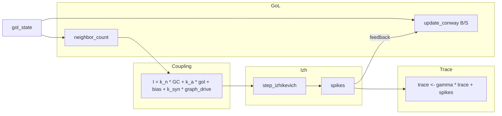

# Conway + Izhikevich Hibrit Simülasyon Projesi — Notebook LM Kaynak Dokümanı

Bu belge, projeyi yapay zeka not defterlerine (ör. Notebook LM) yüklemek ve **amaç, akış, parametreler, yöntem, katkılar ve değerlendirme** ekseninde soru-cevap üretmek için hazırlanmıştır. Teknik iddialar **kod tabanı** (`src/conway_izh/`, `scripts/`, `web/`) ile hizalanır; çıktı rakamları için kendi koşularınızdan `metrics.csv` ve figürler kullanılmalıdır.

---

## 1. Özet: Proje ne yapıyor?

**Bir cümle:** Conway Oyunu Yaşamı (GoL) ile basitleştirilmiş **Izhikevich** nöron modelini aynı sistemde birleştirir; GoL durumu ve komşuluk bilgisi nöronlara **giriş akımı** olarak girer, isteğe bağlı olarak **spike geri beslemesi** ile GoL güncellenir.

**Genişletilmiş özellikler:**

- **Klasik ızgara modu:** Her hücre bir nöron; Moore komşuluğu ile standart B/S kuralları (`conway.py`).
- **Küçük dünya grafiği:** Izgara düğümleri üzerinde Watts–Strogatz benzeri kenarlar (`viz.create_small_world_graph`, `grid.attach_graph_edges`).
- **Graf topolojisi modu:** SWC morfoloji dosyaları + `small_world` + `legacy_cluster` birleşik seyrek graf (`topology_manager.py`, `graph_grid.py`).
- **Canlı yayın:** HTTP üzerinden JSON kareler → Three.js görselleştirici (`viz.py` `StreamServer`, `scripts/run_live.py`).
- **İsteğe bağlı oyun teorisi eşlemesi:** Ayrı kod yolu (`game_theory_coupling.py`, `run_live_gametheory.py`, `run_grid --game-theory`).
- **Verim metrikleri ve (isteğe bağlı) makine öğrenmesi:** Bileşik skorlar (`efficiency.py`), veri şeması (`dataset_schema.py`), CNN eğitim scriptleri.

---

## 2. Bilimsel ve mühendislik motivasyonu

### 2.1 Neden Conway + nöron?

- **Conway** ayrık zamanlı, yerel kural tabanlı bir **hesaplama örüntüsü / gating** sağlar (canlı/komşu sayısı).
- **Izhikevich** sürekli-dynamics ile **spike davranışı** üretir; hesaplama açısından hafiftir ve büyük ağlar için vektörleştirilir.
- Birlikte kullanıldığında sistem, “**discrete cellular state → analog neural drive → spike → optional feedback onto discrete state**” döngüsü kurar.

### 2.2 Projeye özgü odak (tez / poster ile uyumlu)

- **Verim–kararlılık dengesi:** `efficiency_score` ve bileşenleri ile ölçülebilir hedefler (`metrics.py`, `efficiency.py`).
- **Ablation:** Coupling veya geri besleme kapatılarak katkı ayrıştırılabilir (`run_ablation_suite`).
- **Genişletilebilirlik:** Aynı motor ızgara veya birleşik graf üzerinde çalışır; demo ve iletişim için canlı 3B akış vardır.

---

## 3. Sistem mimarisi ve veri akışı

### 3.1 Yüksek seviye akış (ızgara modu, oyun teorisi kapalı)



**Adım sırası (`NeuralGrid.step`, klasik çizgi):**

1. Komşu sayımı (Moore, `wrap_around` seçeneği).
2. Giriş akımı `gol_to_current` + opsiyonel `graph_trace_to_drive`.
3. Izhikevich bir adım; spike maskesi.
4. Spike trace güncellenir (`gamma` ile sönüm).
5. Conway bir jenerasyon ilerler (`birth_neighbors`, `survive_neighbors`).
6. Geri besleme açıksa: spike olan hücreler (ve isteğe bağlı graf komşuları) GoL’da canlı yapılır.
7. Hafıza stratejisi açıksa `memory_state` güncellenir.
8. Metrikler hesaplanır.

**Graf modu (`GraphNeuralGrid`):** Aynı fikir düz `(N,)` dizileri ve CSR `adjacency @ vektör` ile; Conway “komşusu” graf komşusu; derece uyumsuzluğu için eşdeğer 0–8 ölçeğe kuantize edilir (`graph_update_conway`). Düşük dereceli dalların hemen ölmemesi için `low_degree_loose` kuralı vardır.

### 3.2 Modların karşılaştırması

| Mod | Girdi uzayı | Conway komşusu | Kod girişi |
|-----|-------------|----------------|------------|
| Rectangular + small-world edges | H×W | Moore 8 | `NeuralGrid` |
| Unified topology (SWC + …) | N düğüm | Graf derecesi | `GraphNeuralGrid` |
| Stream + UI | Sunucu seçimi | Aynı | `run_live --mode stream` |

---

## 4. Materyal (veri ve yazılım)

### 4.1 Veri

- **SWC morfolojileri:** `data/morphology/*.swc` — nöron ağacı örnekleri; parse → koordinat + seyrek komşuluk (`swc_loader.py`).
- **Çıktı dizinleri:** Varsayılan `outputs/<run_id>/` (`run_grid`); sunum/ablation/thesis/script’e özel alt klasörler `POSTER_TEZ.md` ve `README.md` içinde listelenir.

### 4.2 Yazılım yığını (özet)

- **Python 3**, **NumPy**, **SciPy** (seyrek matris), **matplotlib** / **imageio** (toplama ve GIF için; akış sunucusu soğuk başlatmada ağır importlar geciktirilmiş olabilir).
- **Üç katmanlı web:** Statik HTTP + Three.js görselleştirici (`web/three_visualizer/`).

---

## 5. Yöntem — matematiksel ve algoritmik çekirdek

### 5.1 Conway (ızgara)

- Varsayılan **B3/S23** (`birth_neighbors=(3,)`, `survive_neighbors=(2,3)`); CLI ile değiştirilebilir.
- **`--wrap`:** Toroidal sınır (`wrap_around`).

### 5.2 Conway on graph

- Komşuluk sayısı: `adjacency.dot(gol_state)` — **O(E)**.
- B/S kuralı: `equivalent_count = round(alive_neighbors * 8 / max(degree,1))`; sonra klasik küme üyeliği.
- **`low_degree_loose`:** Derece ≤ 2 ise en az bir canlı komşu varsa hayatta kalma (morfoloji dallarının görsel sürekliliği için).

### 5.3 Izhikevich

- Güncellenmiş denklemler (`izhikevich.py`):  
  \(dv/dt = 0.04 v^2 + 5 v + 140 - u + I\), \(du/dt = a(b v - u)\), zaman adımı `dt`.  
- Spike eşiği: `v >= 30`; reset `(c, u+d)`.
- Varsayılan parametreler: `a=0.02`, `b=0.2`, `c=-65`, `d=8` (`config.IzhikevichParams`; `run_grid` ile override edilebilir).

### 5.4 Eşleme (GoL → akım)

\[
I = k_{\text{neighbors}} \cdot N_{\text{alive\_neighbors}} + k_{\text{alive}} \cdot \text{alive} + \text{bias} + k_{\text{syn}} \cdot (A \, \tau)
\]

- \(N_{\text{alive\_neighbors}}\): ızgarada Moore; grafta `adjacency @ gol`.
- \(\tau\) (spike trace): üstel sönüm + spike ekleme; stream/grid’de `spike_trace_decay` = \(\gamma\) ile kontrol edilir.
- **`k_syn`:** Graf boyunca aktivite yayılımını taklit eden sürücü; 0 ise sadece GoL-tabanlı akım.

### 5.5 Geri besleme (nöron → GoL)

- **Temel:** Spike olan düğüm/ hücre GoL’da canlı yapılır.
- **`feedback_graph_neighbors` (veya `--no-graph-feedback-neighbors` ile kapatma):** Spike’un graf komşuları da canlı olur (`neuron_to_gol_feedback`).
- Graf modunda doğrudan indeks düzlemine uygulanır.

### 5.6 Birleşik topoloji (`build_unified_topology`)

- Seçilen bileşenler (örn. `small_world`, `legacy_cluster`, SWC anahtarları) **blok-diagonal CSR** olarak birleşir — bileşenler arası kenar yok; uzamsal olarak ofset ile ayrılırlar.
- Kenar listesi üst üçgenden çıkarılıp `(E,2) int32` olarak API ve görselleyiciye iletilir.

### 5.7 Oyun teorisi kısayolu (istikrarlı kullanıcı yolu için özet)

- `use_game_theory=True` iken Conway tabanlı olasılık + yayılım + hücre stratejisi karışımı kullanılır (`grid.py` dalı).
- Varsayılan `run_live`/`run_grid` tez/demo yolu çoğu zaman klasik coupling üzerinden gider.

### 5.8 Hafıza ve verim bileşeni

- **`MemoryParams`:** Spike ve komşu terimleri ile süzülmüş durum (`memory_state`); decay, gain, clipping.
- **Verim bileşeni formüllerinin özeti (`efficiency.py`):**
  - **Stability:** Orta düzey canlılık (~0.35) ve firing (~0.18) etrafında ödül.
  - **Information:** `tanh` ile firing, işbirlikçi oran, strateji kayması cezası.
  - **Memory:** Ortalama hafızaya yakınlık + uyum bonusu.
  - **Cost:** Spike yoğunluğu ve firing cezası.
  - **Efficiency:** Ağırlıklı bileşik skor − maliyet ağırlığı (varsayılan ağırlıklar kodda).

---

## 6. Parametreler: ne yapar, ne beklenir?

### 6.1 `SimulationConfig` / ortak yapı (`config.py`)

| Parametre | Tip | Varsayılan (yer) | Beklenen etki |
|-----------|-----|-------------------|---------------|
| `height`, `width` | int | 60×60 | Toplam nöron/Hücre sayısı \(H\cdot W\) |
| `steps` | int | 300 | Zaman ufku; istatistik güvenilirliği |
| `seed` | int? | 42 (`run_live` stream) | Tekrarlanabilirlik |
| `dt` | float | 0.1 | Izhikevich alt adım süresi; büyük değerler osilasyon/instabilité riski |
| `birth_neighbors`, `survive_neighbors` | tuple | (3,), (2,3) | GoL faz davranışı; ölü/canlı rejim geçişleri |
| `wrap_around` | bool | False | Kenar efektleri vs torus |
| `small_world_k`, `small_world_rewire` | int, float | 6, 0.08 | Yerel bağlılık ve rastlantısal uzun bağ sayısı |
| `coupling.*` | aşağı | — | Ana davranış kolu |
| `memory.*` | aşağı | enabled=True | Efficiency’de memory_score’a girdi |
| `strategy.*` | — | GT modunda | İşbirlikçi/greedy seçimleri |

### 6.2 `CouplingParams` — davranışı en çok değiştiren grup

| Parametre | Varsayılan (`config` göre) | Etkisi |
|-----------|----------------------------|--------|
| `k_neighbors` | 0.5 | Canlı komşu sayısının akıma katkısı; artış → daha fazla uyarılmış dinamik |
| `k_alive` | 4.0 (`run_live` stream); 2.0 (`run_grid` CLI) | **Canlı** hücrenin doğrudan sürüşü |
| `bias` | 0.5 (config); stream’de sıfırlamak için kod/ kontrol ile değişir | Sürekli ofset akımı; sürekli veya daha seyrek spike eğilimi |
| `feedback_enabled` | False (`run_grid`); True (`run_live` stream varsayılanı kontrol bağlı) | **İki yönlü** kapı: spike → GoL canlı yapma |
| `k_syn` | 2.8 (stream CLI); 0 (`config` düz varsayılan) | Grafsal trace sürüşü; 0 ise graf etkisi yok |
| `spike_trace_decay` | 0.88 | Trace’in hafızası; yüksek → uzun süreli yayılım hissiyatı |
| `feedback_graph_neighbors` | False (config default); True (stream için tipik) | Spike komşularını da uyarma (C seçeneği) |
| `use_game_theory` | False | Spike karar ve geri besleme için alternatif matematik |

**Pratik rehber:** Önce sabit `seed` ile `k_alive`/`k_neighbors` küçük adımlarla ayarlanır; sonra `k_syn` ve `feedback_graph_neighbors` graf modunda tepkiyi güçlendirir.

### 6.3 `scripts/run_live.py` (stream) bayrakları

| Bayrak | Anlamı |
|--------|--------|
| `--mode stream` vs `matplotlib` | JSON yayın vs yerel grafik animasyon |
| `--port`, `--host` | HTTP bağlama |
| `--topology KEY,KEY,...` | Başlangıç seçimi (boş ise düz küçük-dünya ızgaralı yol olabilir) |
| `--small-world-n` | Small-world bileşeninde düğüm sayısı |

### 6.4 `scripts/run_grid.py` — önemli CLI

| Argüman | Not |
|---------|-----|
| `--feedback` | Spike → GoL |
| `--game-theory` | Alternatif kopling |
| `--memory-enabled`, `--memory-*`, `--cellwise-strategy` | Ek dinamikler |
| `--k-alive`, `--k-neighbors`, `--bias` | Eşleme gücü |

### 6.5 Görselleştirici (ön yüz)

- **`Oncelik`:** Bloom/segment kalitesi (`visualizer.js` QUALITY_PRESETS).
- **`Jenerasyon suresi`:** Kontrol olarak `generation_period_ms`; simülasyon hız hissiyatı.

---

## 7. Çıktılar ve deney araç zinciri

| Amaç | Üretilen / komut |
|------|------------------|
| Ham batch simülasyon | `python -m scripts.run_grid ...` → `final_gol.png`, `metrics.csv`, … |
| Sunum grafikleri | `create_presentation_plots.py` → `outputs/presentation_plots/` |
| Ablation | `run_ablation_suite.py` → `outputs/ablation/` |
| CNN verisi / model | `generate_efficiency_dataset`, `train_efficiency_cnn`, `eval_efficiency_cnn` |
| Tez figürleri özeti | `plot_thesis_figures.py` |
| Karşılaştırma analizi | `compare_izhikevich` + `analyze_comparison.py` |
| Hipertaram | `hyperparameter_optimization.py`, `sweep_k_syn_gamma.py` |

Zaman karmaşıklığı özeti:

- Seyrek graf adımı: **O(E)** komşuluk/trace mat-vec + **O(N)** Izhikevich ve GoL güncellemesi.
- Birleşik topoloji inşası: bileşen sayısı ve N’ye lineer (**O(Σ Ni + Ei)**); karmaşık topoloji inşaatı kodda optimize edilmiştir.

---

## 8. Sonuç ve değerlendirme (tez için çerçeve)

### 8.1 Ne raporlanmalı?

- **Zaman serisi:** `alive_count`, `spike_count`, `mean_v`, `firing_rate`, `efficiency_score` (ve alt bileşenler) — çok tohum için ortalama ± std.
- **Koşu karşılaştırması:** Feedback açık/kapalı; `k_syn` 0 / pozitif; tek vs çok topoloji.
- **Ablation özeti:** Hangi kopling teriminin kapatılması metrikleri nasıl kaydırıyor.
- **İsteğe bağlı:** CNN için train/val kaybı ve test MAE/`R²` (`train_efficiency_cnn` çıktıları).

### 8.2 Yorum için dikkat noktaları

- **Graf-vs-ızgarayı karıştırmama:** Graf modunda “komşu” Moore değildir; aynı B/S parametreleri farklı dağılımlara yol açabilir.
- **Web görselleştirici vs çekirdek:** Üçüncü şahıs kütüphane + tone mapping ile estetik fark oluşabilir; bilimsel iddia Python koşusu üzerine kurulmalı.
- **Tek tohum:** Anlatıcı ama güvenlik düşük; istatistik için çok seed.

---

## 9. Projeye akademik katkılar (makul iddia listesi)

1. **Hibrit CA– nöron bağlantısı:** GoL’ın hesaplama gating olarak Izhikevich sürüşü ile somut matematik bağlantısı ve isteğe bağlı graf salınım kanalı (`k_syn`, trace).
2. **Ölçülebilir verim bileşeni:** Çok-hedef özet skor ile karşılaştırılabilir deney tasarımı (`efficiency.py`).
3. **Ölçeklenebilir graf motoru:** SWC birleştirerek biyolojik ağacı yapay graf CA ile birleştirme + seyreklik ile bellek dostu yaklaşım.
4. **Yeniden üretilebilir mühendislik:** Seed, CSV çıktılar, script zinciri (`ablation`, `thesis figures`).
5. **Demokratik iletişim katmanı:** Canlı yayın ile hipotezin izlenmesi (`run_live`, Three.js).

---

## 10. Sınırlamalar ve gelecek işler

| Sınırlama | Kısa açıklama |
|-----------|----------------|
| Biyofizik derinlik | Izhikevich + Soyut GoL; gerçek sodyum kanalı/detaylı sinaps modeli değildir |
| Parametre boyutu | Geniş küme; eksiksiz küresel optimumdan bahsetmek zor |
| Oyun teorisi maliyeti | Ek dallar hesaplama açısından daha ağır olabilir |
| Donanım verimi | Kod içi verim enerji ölçümü ile doğrulanmamıştur |

İyi yönler için `POSTER_TEZ.md` bölüm 6–8 ile uyumlu ilerleme başlıkları genişletilebilir.

---

## 11. Kod haritası (arama için)

```
src/conway_izh/
  config.py           # Tüm parametre yapıları
  conway.py           # İzgara GoL
  izhikevich.py       # Sürekli dinamik
  coupling.py         # gol_to_current, graph_trace_to_drive, feedback
  grid.py             # NeuralGrid ana döngü
  graph_grid.py       # GraphNeuralGrid
  topology_manager.py, swc_loader.py
  viz.py              # Yayın köprüsü ve HTTP sunucusu
  efficiency.py, metrics.py
  game_theory_coupling.py
scripts/
  run_grid.py, run_live.py, start_full_stack.ps1
  run_ablation_suite.py, plot_thesis_figures.py, …
web/three_visualizer/ # İstemci görselleyici
```

---

## 12. Sözlük

| Terim | Kısa anlamı |
|-------|--------------|
| GoL | Conway Game of Life |
| B/S | Birth / Survive komşu listeleri |
| CSR | Seyrek satır sıkıştırılmış matris |
| SWC | Nöron morfoloji dosya formatı |
| Trace | Spike geçmişinin üstel süzülmüş hali |
| Stream | Sunucudan JSON kare akışı |

---

## 13. Bu belgeyi Notebook LM’de nasıl kullanırsınız?

1. Bu `.md` dosyasını kaynak olarak yükleyin.
2. İsteğe bağlı: `README.md`, `POSTER_TEZ.md`, bir örnek `metrics.csv` ve tez metninizden “Sonuçlar” bölümünü ekleyin.
3. Örnek sorular: “Graf modunda Conway nasıl genelleniyor?”, “k_syn kapatılınca ne olur?”, “efficiency_score nasıl hesaplanıyor?”, “Hangi script hangi çıktıyı üretir?”

---

*Son güncelleme: Dosya oluşturulduğu tarih itibarıyla kod yapısı ile uyumludur. Parametre varsayılanları küçük sürüm farkları için `config.py` ve ilgili `argparse` tanımları üzerinden doğrulanmalıdır.*
